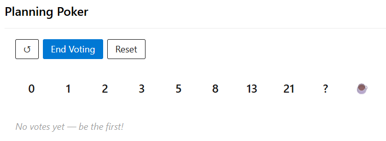

# Planning Poker for Azure DevOps

Run Planning Poker estimation sessions directly on work items — no external tools, no sign-ups, no hidden costs. All data stays inside your Azure DevOps organisation.

## What is added on installation

- A **Planning Poker** panel on every work item form
- A **Planning Poker** page under Project Settings

## Functionality

All team members open the same work item and each selects a story-point estimate from a set of cards. Votes are hidden until the facilitator ends the round, preventing anchoring bias.

**Vote** — Click a card to cast your estimate. Click it again to take it back. The panel shows who has voted as votes arrive.

**End Voting** — Reveals all votes simultaneously, grouped by value. When the "Post comment" setting is on, a formatted results summary is posted to the work item history so the outcome is permanently recorded.

**Resume Voting** — Returns to the voting phase with existing votes preserved, so the team can reconsider after discussion.

**New Round** — Clears all votes and starts a fresh estimation round.

The panel updates automatically in the background so everyone sees new votes without needing to refresh the page.

The voting panel is hidden on work items in terminal states (such as Done or Removed). The states that trigger this are configurable.

## Azure DevOps pre-requisites

None. The extension works with every Azure DevOps project out of the box.

## Configuration

Go to **Project Settings → Planning Poker** to adjust:

| Setting | Default | Description |
|---|---|---|
| Card values | 0 1 2 3 5 8 13 21 ? | The cards shown during a voting session. Changes apply to all users in the organisation. |
| Disabled states | Done, Removed | Work item states where the voting panel is hidden. |
| Post comment | On | Post a results summary to the work item history when voting ends. |
| Auto-refresh interval | 5 seconds | How often the panel checks for new votes. Set to Off to disable background polling. |
| Anonymous voting | Off | Hide voter names during the voting phase. Only the vote count is shown until End Voting is clicked. |
| Show settings | On | Whether the settings button is visible to all users. Disable to restrict access to administrators. |

The panel can be removed from specific work item types from **Project Settings → Process → [Type] → Layout**.

## Privacy and data storage

Votes and settings are stored in the Azure DevOps Extension Data Service — a built-in, free key-value store included with every Azure DevOps organisation. No data leaves your Azure DevOps instance.

Vote values are stored server-side as soon as a card is clicked. Concealment is enforced by the panel; the raw data is accessible to anyone with permission to query extension data in your collection. This is the standard approach for zero-infrastructure extensions and is appropriate for trusted teams.

## Permissions

| Permission | Reason |
|---|---|
| Read work items | Read work item details such as ID, project, and state, and to associate votes with the correct item |
| Write work items | Post the results summary comment to the work item history when voting ends |

## Questions, ideas, or bugs?

[Open an issue on GitHub](https://github.com/neoftl/planning-poker-azdo/issues) — we would love to hear from you.
